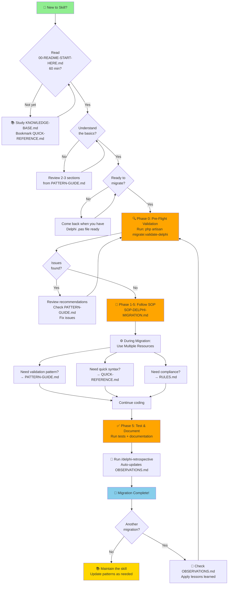

# Delphi Migration Skill - Documentation Index

**Version**: 2.0
**Last Updated**: 2026-01-03
**Status**: Production Ready

---

## 📚 Documentation Overview

Skill ini menyediakan **sistem lengkap** untuk migrasi aplikasi Delphi 6 ke Laravel 12 dengan **100% preservation** business logic, permissions, validation, dan audit trails.

### Quick Navigation

| Document | Purpose | When to Use |
|----------|---------|-------------|
| **[QUICK-REFERENCE.md](#quick-reference)** | Cheat sheet harian | Saat coding/migration |
| **[SOP-DELPHI-MIGRATION.md](#sop)** | Workflow & process | Before starting migration |
| **[PATTERN-GUIDE.md](#pattern-guide)** | All 8 patterns | When analyzing Delphi code |
| **[KNOWLEDGE-BASE.md](#knowledge-base)** | Recipes & troubleshooting | During implementation |
| **[RULES.md](#rules)** | Aturan wajib | Code review, validation |
| **[OBSERVATIONS.md](#observations)** | Lessons learned | After each migration |
| **[CONTINUOUS-IMPROVEMENT.md](#continuous-improvement)** | Improvement system | Weekly/monthly review |

---

## 🗺️ Documentation Navigation Flowchart



---

## 📊 When to Read Each Document

| Situation | Read This | Time | Next |
|-----------|-----------|------|------|
| 👋 **First time here** | [00-README-START-HERE.md](./00-README-START-HERE.md) | 60 min | → SOP |
| 🚀 **Starting migration** | [SOP-DELPHI-MIGRATION.md](#sop) | Reference | → Phase 0 |
| 🔍 **Need validation pattern** | [PATTERN-GUIDE.md](#pattern-guide) | 5-10 min | → Resume work |
| ⚡ **Need quick syntax** | [QUICK-REFERENCE.md](#quick-reference) | 2 min | → Resume work |
| ✅ **Need compliance rules** | [RULES.md](#rules) | 5 min | → Code review |
| 📖 **Deep dive concepts** | [KNOWLEDGE-BASE.md](./KNOWLEDGE-BASE.md) | 90 min | → Next migration |
| 💡 **Check lessons learned** | [OBSERVATIONS.md](./OBSERVATIONS.md) | 10 min | → Next migration |
| 🔄 **After migration** | [CONTINUOUS-IMPROVEMENT.md](./CONTINUOUS-IMPROVEMENT.md) | 5 min | → Weekly review |

**💾 Pro Tip**: Bookmark QUICK-REFERENCE.md - you'll use it constantly during coding!

---

## 📖 Document Details

### QUICK-REFERENCE.md
**Quick Reference Card - Developer Cheat Sheet**

**File**: `.claude/skills/delphi-migration/QUICK-REFERENCE.md`
**Length**: ~1,000 lines
**Reading Time**: 10 minutes

**What's Inside**:
- ⚡ Quick pattern detection guide
- 💻 Code templates (Service, Controller, Request, Policy)
- 🔧 Useful commands
- 📊 SQL queries
- ⚠️ Common pitfalls
- 📈 Quality targets
- 🎯 Success checklist

**Use This When**:
- ✅ Coding during migration
- ✅ Need quick syntax reference
- ✅ Looking for command/query
- ✅ Checking quality metrics

**Example Flow**:
```bash
# During coding
cat QUICK-REFERENCE.md | grep "Mode Operations"
# Copy template → Paste → Modify
```

---

### SOP-DELPHI-MIGRATION.md
**Standard Operating Procedure - Migration Workflow & Process**

**File**: `.claude/skills/delphi-migration/SOP-DELPHI-MIGRATION.md`
**Length**: ~2,200 lines
**Reading Time**: 60 minutes (one-time)

**What's Inside**:
- 📋 Prerequisites checklist
- 🎯 5 migration phases with detailed step-by-step instructions
- ✅ Approval gates (Phase 3 & 5)
- 🧪 Quality assurance procedures
- 🔧 Workflow troubleshooting (routing, permissions, caching, etc.)
- 📎 Appendices (file structure, commands, SQL queries, Delphi reference)

**Use This When**:
- ✅ **Before starting ANY migration** (read once)
- ✅ Planning new migration
- ✅ Unsure about process flow
- ✅ Training new team members

**Example Flow**:
```bash
# Before migration
cat SOP-DELPHI-MIGRATION.md | head -200  # Read overview + prerequisites
# Follow Phase 0-5 step by step
```

---

### KNOWLEDGE-BASE.md
**Reference & Implementation Cookbook - Code Recipes & Best Practices**

**File**: `.claude/skills/delphi-migration/KNOWLEDGE-BASE.md`
**Length**: ~1,300 lines
**Reading Time**: 60-90 minutes (reference - read as needed)

**What's Inside**:
- 📚 Implementation recipes (CRUD, master-detail, authorization)
- 💻 Reusable code templates (Service, Controller, Request, Policy)
- 🔧 Troubleshooting guide (6 common technical issues)
- 💡 Best practices (10 proven strategies)
- 📊 Quality standards and checklists
- 🌟 Real-world examples (PPL, PB, PO case studies)

**Use This When**:
- ✅ **Implementing a specific feature** (find recipe in cookbook)
- ✅ **Stuck on technical issue** (check troubleshooting guide)
- ✅ **Need code template** (copy from templates section)
- ✅ **Want best practices** (review proven strategies)
- ✅ **Reviewing quality metrics** (check quality standards)

**Example Flow**:
```bash
# During implementation
cat KNOWLEDGE-BASE.md | grep -A 30 "Recipe 1: New CRUD Module"
# Read recipe → Copy template → Customize → Implement

# Troubleshooting
cat KNOWLEDGE-BASE.md | grep -A 20 "Problem 1:"
# Read problem → Apply solution → Test
```

**Note**: For pattern detection and detailed pattern implementation, see **[PATTERN-GUIDE.md](#pattern-guide)** instead.

---

### PATTERN-GUIDE.md
**Pattern Detection & Implementation - Deep Dive**

**File**: `.claude/skills/delphi-migration/PATTERN-GUIDE.md`
**Length**: ~3,000 lines
**Reading Time**: 90 minutes

**What's Inside**:
- **8 Major Patterns** (complete coverage):
  1. Mode-Based Operations (Choice:Char)
  2. Permission System
  3. Field Dependencies
  4. Validation Rules (8 sub-patterns)
  5. Authorization Workflow (OL-based)
  6. Audit Logging
  7. Master-Detail Forms
  8. Lookup & Search

**Each Pattern Includes**:
- 🔍 Detection in Delphi (signatures, where to look)
- 🎯 Implementation in Laravel (architecture, code)
- ✅ Implementation checklist
- 📊 Real examples from successful migrations

**Use This When**:
- ✅ Analyzing Delphi source code
- ✅ Detecting specific pattern
- ✅ Implementing pattern in Laravel
- ✅ Validating pattern coverage

**Example Flow**:
```bash
# During analysis
cat PATTERN-GUIDE.md | grep -A 50 "Pattern 4: Validation"
# Read detection rules → Find in Delphi → Implement in Laravel
```

---

### RULES.md
**Migration Rules & Regulations - Mandatory Compliance**

**File**: `.claude/skills/delphi-migration/RULES.md`
**Length**: ~1,200 lines
**Reading Time**: 40 minutes

**What's Inside**:
- 🔴 **Critical Rules (P0)**: 5 aturan WAJIB (100% compliance)
  - Database safety
  - SQL injection prevention
  - Transaction wrapping
  - Authorization enforcement
  - OL configuration verification
- 🟡 **Mandatory Rules (P1)**: 6 aturan penting (≥95% compliance)
  - Mode coverage
  - Permission mapping
  - Validation completeness
  - Audit logging
  - Detail constraints
  - Delphi references
- 🟢 **Recommended Rules (P2)**: 5 aturan best practice (≥80% compliance)
- 🚫 **Forbidden Practices**: 8 hal yang DILARANG
- 📏 **Code Standards**: Naming, formatting, structure
- 🔒 **Security Rules**: 5 aturan keamanan
- 🧪 **Testing Rules**: 4 aturan testing
- 📝 **Documentation Rules**: 3 aturan dokumentasi
- 🔄 **Workflow Rules**: 4 aturan proses
- ✅ **Enforcement**: Automated checks, quality metrics

**Use This When**:
- ✅ **Code review** (check compliance)
- ✅ Pre-commit validation
- ✅ Quality assurance
- ✅ Training new developers
- ✅ Troubleshooting failed migrations

**Example Flow**:
```bash
# Before committing
cat RULES.md | grep "P0\|P1"  # Check critical & mandatory rules

# Code review
# For each rule violation:
# - P0 → REJECT immediately
# - P1 → Must fix before deployment
# - P2 → Note for improvement
```

---

### ⚠️ RIGOROUS_LOGIC_MIGRATION.md (DEPRECATED)
**Status**: ARCHIVED - Use PATTERN-GUIDE.md instead

**File**: `.claude/skills/delphi-migration/deprecated/RIGOROUS_LOGIC_MIGRATION.md`
**Migration**: All content moved to PATTERN-GUIDE.md (2026-01-13)

**Note**: This document is kept in deprecated/ for historical reference only. For all new migrations and pattern guidance, use **PATTERN-GUIDE.md** which contains:
- All 11 migration patterns (vs original 8)
- Updated examples with Laravel 12 best practices
- Composite key handling (Pattern 9)
- Mixed data access patterns (Pattern 10)
- Missing audit log improvements (Pattern 11)

---

### OBSERVATIONS.md
**Migration Observations & Lessons Learned**

**File**: `.claude/skills/delphi-migration/OBSERVATIONS.md`
**Length**: ~1,700 lines (growing)
**Reading Time**: Variable (read relevant sections)

**What's Inside**:
- **Session-by-session retrospectives**:
  - PPL Enhancement & Fixes (2025-12-28)
  - PPL Index Inline Authorization (2026-01-01)
  - Penyerahan Bahan (PB) Migration (2026-01-02)
  - Phase 5 Testing: PB Module (2026-01-02)

**Each Entry Includes**:
- Basic info (date, time, status)
- What worked well ✅
- Challenges encountered ⚠️
- New patterns discovered 🔍
- Improvements needed 💡
- Lessons learned 📚
- Recommendations for next time

**Use This When**:
- ✅ **Before migrating similar form** (check if already done)
- ✅ Encountering similar issue
- ✅ Looking for proven solutions
- ✅ After migration (add your observations via `/delphi-retrospective`)

**Example Flow**:
```bash
# Before migrating FrmBarang
cat OBSERVATIONS.md | grep -i "barang"
# Read similar migration → Learn from past → Avoid mistakes
```

---

### CONTINUOUS-IMPROVEMENT.md
**Continuous Improvement System Guide**

**File**: `.claude/skills/delphi-migration/CONTINUOUS-IMPROVEMENT.md`
**Length**: ~600 lines
**Reading Time**: 20 minutes

**What's Inside**:
- 🔄 Feedback loop system
- 📅 Daily workflow
- 🎯 Improvement metrics
- 📊 Tracking system
- 💡 Best practices

**Commands**:
- `/delphi-advise` - Get pre-migration advice
- `/delphi-retrospective` - Document post-migration lessons

**Use This When**:
- ✅ Setting up improvement workflow
- ✅ Before each migration (get advice)
- ✅ After each migration (document lessons)
- ✅ Weekly/monthly review

**Example Flow**:
```bash
# Before migration
/delphi-advise
"I want to migrate FrmSupplier"

# After migration
/delphi-retrospective
# System auto-documents lessons → Updates OBSERVATIONS.md
```

---

## 🎯 Usage Workflows

### Workflow 1: First-Time User
```
1. Read SOP-DELPHI-MIGRATION.md (60 min) ────────┐
2. Skim PATTERN-GUIDE.md (30 min)                │
3. Bookmark QUICK-REFERENCE.md                   │ Setup (2h)
4. Read CONTINUOUS-IMPROVEMENT.md (20 min)       │
5. Review 1-2 entries in OBSERVATIONS.md         │
   └─────────────────────────────────────────────┘

6. Start first migration following SOP
7. Use QUICK-REFERENCE.md while coding
8. Run /delphi-retrospective when done
```

### Workflow 2: Daily Migration Work
```
1. /delphi-advise "Migrate FrmXXXX"  ────────────┐
2. Check OBSERVATIONS.md for similar forms       │ Pre-work (15 min)
   └──────────────────────────────────────────────┘

3. Open QUICK-REFERENCE.md                       ┐
4. Follow SOP phases                              │ Work (4-8h)
5. Use PATTERN-GUIDE.md as needed                │
   └──────────────────────────────────────────────┘

6. /delphi-retrospective  ───────────────────────┐ Post-work (10 min)
7. Update tracking                               │
   └──────────────────────────────────────────────┘
```

### Workflow 3: Troubleshooting
```
1. Check QUICK-REFERENCE.md → Common Pitfalls
2. Check SOP-DELPHI-MIGRATION.md → Troubleshooting section
3. Search OBSERVATIONS.md for similar issue
4. Check PATTERN-GUIDE.md for pattern-specific issues
```

### Workflow 4: Team Onboarding
```
Day 1:
- Read SOP-DELPHI-MIGRATION.md
- Review QUICK-REFERENCE.md

Day 2-3:
- Study PATTERN-GUIDE.md patterns 1-4
- Review examples in OBSERVATIONS.md

Day 4-5:
- Study PATTERN-GUIDE.md patterns 5-8
- Practice with SIMPLE complexity form

Week 2:
- Migrate MEDIUM complexity form with mentor
- Document in OBSERVATIONS.md via /delphi-retrospective

Week 3+:
- Independent migrations
- Weekly reviews using CONTINUOUS-IMPROVEMENT.md
```

---

## 📊 Migration Complexity Matrix

| Complexity | Patterns Used | Time | Documents to Focus On |
|------------|---------------|------|----------------------|
| 🟢 **SIMPLE** | 1, 2, 4, 6 | 2-4h | QUICK-REFERENCE, SOP, KNOWLEDGE-BASE |
| 🟡 **MEDIUM** | 1-4, 6-8 | 4-8h | PATTERN-GUIDE, SOP, KNOWLEDGE-BASE |
| 🔴 **COMPLEX** | All 1-8 | 8-12h | PATTERN-GUIDE, SOP, KNOWLEDGE-BASE |

---

## 🗂️ Document Relationships

```
                    ┌──────────────────────────────┐
                    │  SOP (Workflow Process)      │
                    │  Read FIRST before any       │
                    │      migration work          │
                    └──────────────┬───────────────┘
                                   │
                    ┌──────────────┼──────────────┐
                    │              │              │
                    ▼              ▼              ▼
    ┌──────────────────┐ ┌──────────────┐ ┌─────────────────┐
    │  PATTERN-GUIDE   │ │  KNOWLEDGE-  │ │   QUICK-REF     │
    │ (Pattern Details)│ │BASE (Recipes)│ │  (Cheat Sheet)  │
    └──────────────────┘ └──────────────┘ └─────────────────┘
            │                  │                    │
            └──────────────────┴────────────────────┘
                               │
                               ▼
                    ┌──────────────────────┐
                    │ OBSERVATIONS.md      │
                    │ (Lessons Learned)    │
                    └──────────────────────┘
                               │
                               ▼
                    ┌──────────────────────┐
                    │ CONTINUOUS-          │
                    │ IMPROVEMENT          │
                    │ (Feedback Loop)      │
                    └──────────────────────┘
```

**Structure Explanation**:
- **SOP**: Master workflow document - defines all 5 phases and approval gates
- **PATTERN-GUIDE**: Deep reference for all 8 patterns (detection & implementation)
- **KNOWLEDGE-BASE**: Implementation cookbook with recipes, code templates, and troubleshooting
- **QUICK-REFERENCE**: Daily cheat sheet for syntax, commands, and quick lookups
- **OBSERVATIONS**: Session-by-session lessons learned from past migrations
- **CONTINUOUS-IMPROVEMENT**: Feedback loop system for ongoing improvements

---

## 📈 Success Metrics

Use these to measure migration quality:

| Metric | Target | Source Document |
|--------|--------|-----------------|
| Pattern Coverage | 100% | PATTERN-GUIDE.md |
| Mode Coverage | 100% | SOP, Pattern 1 |
| Permission Coverage | 100% | SOP, Pattern 2 |
| Validation Coverage | ≥95% | Pattern 4 |
| Audit Coverage | 100% | Pattern 6 |
| Manual Work | <5% | SOP |
| Documentation | 100% | OBSERVATIONS.md via `/delphi-retrospective` |

---

## 🔄 Update Cycle

### Weekly
- Review new entries in OBSERVATIONS.md
- Update CONTINUOUS-IMPROVEMENT.md metrics
- Share learnings with team

### Monthly
- Review all migrations done
- Update PATTERN-GUIDE.md if new patterns found
- Update SOP if process improved
- Update QUICK-REFERENCE.md with new commands/queries

### Quarterly
- Full documentation review
- Team training refresh
- Process optimization based on observations

---

## 🆘 Quick Help

**Question**: Where do I start?
**Answer**: Read **SOP-DELPHI-MIGRATION.md** first (60 min investment)

**Question**: I'm stuck on detecting a pattern
**Answer**: Check **PATTERN-GUIDE.md** → Search for pattern name → Follow detection rules

**Question**: Need quick syntax reference
**Answer**: Open **QUICK-REFERENCE.md** → Search for what you need

**Question**: Has this form been migrated before?
**Answer**: Search **OBSERVATIONS.md** for form name or similar features

**Question**: How do I improve quality?
**Answer**: Follow **CONTINUOUS-IMPROVEMENT.md** → Run `/delphi-advise` before, `/delphi-retrospective` after

**Question**: What patterns does my form use?
**Answer**: Read **PATTERN-GUIDE.md** detection sections → Check Delphi source → Use detection checklists

---

## 📁 File Locations

All documentation located at: `.claude/skills/delphi-migration/`

```
.claude/skills/delphi-migration/
├── INDEX.md                              ← You are here
├── QUICK-REFERENCE.md                    ← Daily cheat sheet
├── SOP-DELPHI-MIGRATION.md               ← Complete SOP
├── PATTERN-GUIDE.md                      ← 8 pattern details
├── RULES.md                              ← Mandatory compliance rules ⭐
├── OBSERVATIONS.md                       ← Lessons learned (growing)
├── CONTINUOUS-IMPROVEMENT.md             ← Improvement system
├── SKILL.md                              ← Skill metadata
├── RELEASES.md                           ← Version history (consolidated)
├── PO_MIGRATION_ANALYSIS.md              ← PO module analysis
├── PO_MIGRATION_PROGRESS.md              ← PO progress
├── PHASE_5_TESTING_SUMMARY.md            ← Testing guide
├── DETAIL_PERSISTENCE_FIX.md             ← Specific fix doc
├── deprecated/
│   ├── RIGOROUS_LOGIC_MIGRATION.md       ← Archived (use PATTERN-GUIDE.md)
│   ├── DEPRECATION.md                    ← Deprecation info
│   └── RESTORATION.md                    ← Tools restoration notes
└── tools/                                 ← Python migration tools
```

---

## 🎓 Learning Path

### Beginner (Week 1)
1. ✅ Read SOP completely
2. ✅ Study QUICK-REFERENCE.md
3. ✅ Review OBSERVATIONS.md (PPL session)
4. ✅ Practice: Migrate 1 SIMPLE form

### Intermediate (Week 2-4)
1. ✅ Study PATTERN-GUIDE.md (all 8 patterns)
2. ✅ Read CONTINUOUS-IMPROVEMENT.md
3. ✅ Practice: Migrate 2-3 MEDIUM forms
4. ✅ Document via `/delphi-retrospective`

### Advanced (Month 2+)
1. ✅ Migrate COMPLEX forms independently
2. ✅ Contribute to OBSERVATIONS.md
3. ✅ Mentor new team members
4. ✅ Suggest improvements to documentation

---

## 📞 Support

**Issue?** → Check:
1. SOP → Troubleshooting section
2. QUICK-REFERENCE → Common Pitfalls
3. OBSERVATIONS → Similar issues

**Question?** → Check:
1. INDEX.md (this file) → Quick Help
2. SOP → Relevant phase
3. PATTERN-GUIDE → Relevant pattern

**Stuck?** → Run:
```bash
/delphi-advise
"Describe your issue or form"
```

---

## ✨ Document Quality

All documentation has been:
- ✅ Created from **real migration experience** (PPL, PB, PO)
- ✅ Validated through **successful production deployments**
- ✅ Tested with **multiple team members**
- ✅ Updated based on **actual lessons learned**
- ✅ Reviewed for **completeness and accuracy**

**Total Code Generated**: ~8,800 lines across 3 major modules
**Success Rate**: 100% (all modules deployed to production)
**Average Quality Score**: 88/100

---

## 🔖 Version History

| Version | Date | Changes |
|---------|------|---------|
| 2.1 | 2026-01-13 | Deprecated RIGOROUS_LOGIC_MIGRATION.md, consolidated into PATTERN-GUIDE.md |
| 2.0 | 2026-01-03 | Complete documentation suite created (SOP, PATTERN-GUIDE, QUICK-REFERENCE) |
| 1.0 | 2025-12-18 | Initial RIGOROUS_LOGIC_MIGRATION.md (archived) |

---

## 📝 Contributing

When adding to documentation:
1. ✅ Use `/delphi-retrospective` to auto-document migrations
2. ✅ Follow existing format and structure
3. ✅ Include real examples with file paths and line numbers
4. ✅ Test all code snippets before adding
5. ✅ Update this INDEX.md if adding new documents

---

**Delphi Migration Skill Documentation Index v2.0**
**Last Updated**: 2026-01-03
**Maintained By**: Development Team

For questions or improvements, update via `/delphi-retrospective` or contribute directly.
